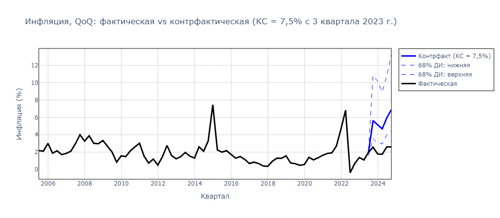
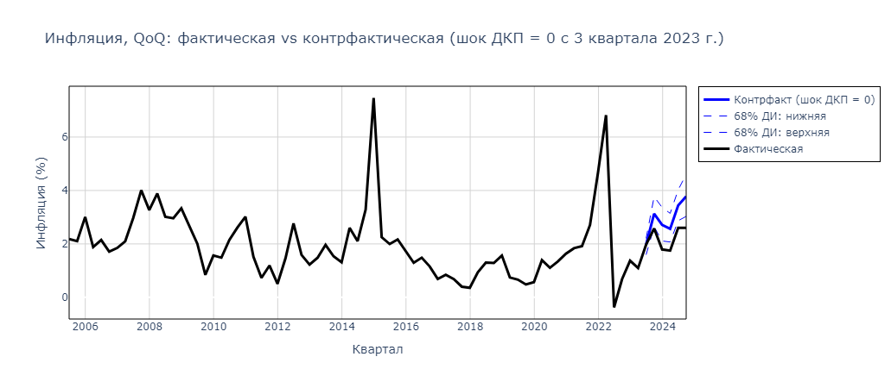
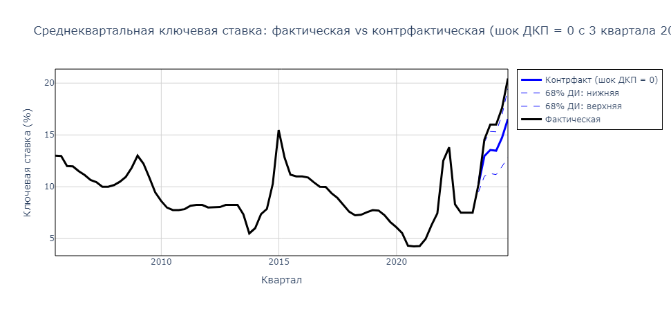
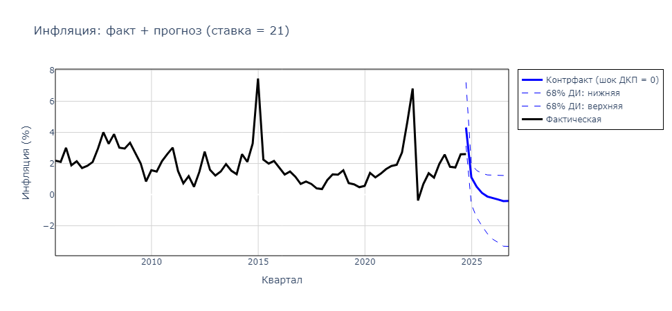
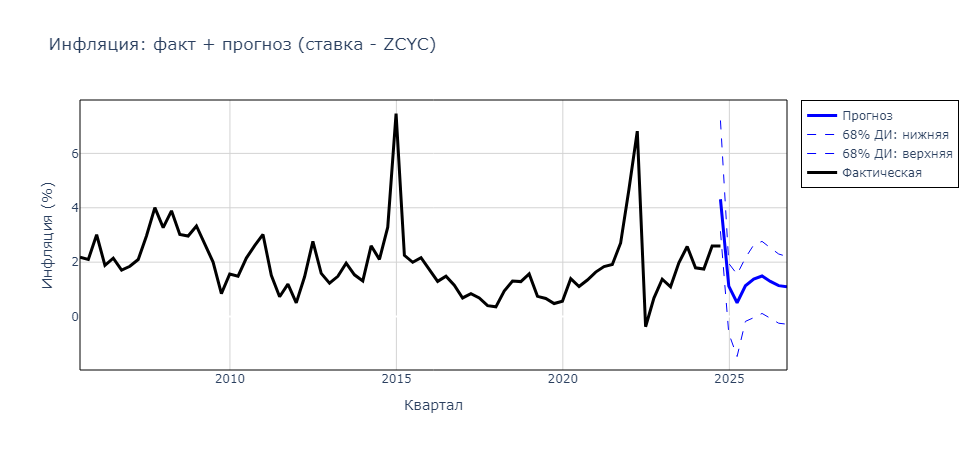
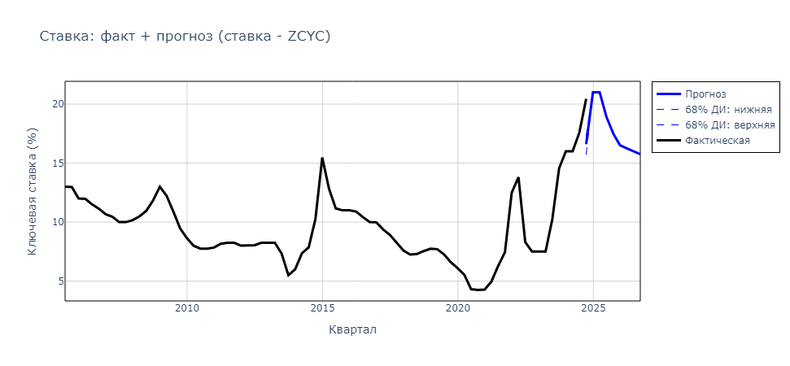
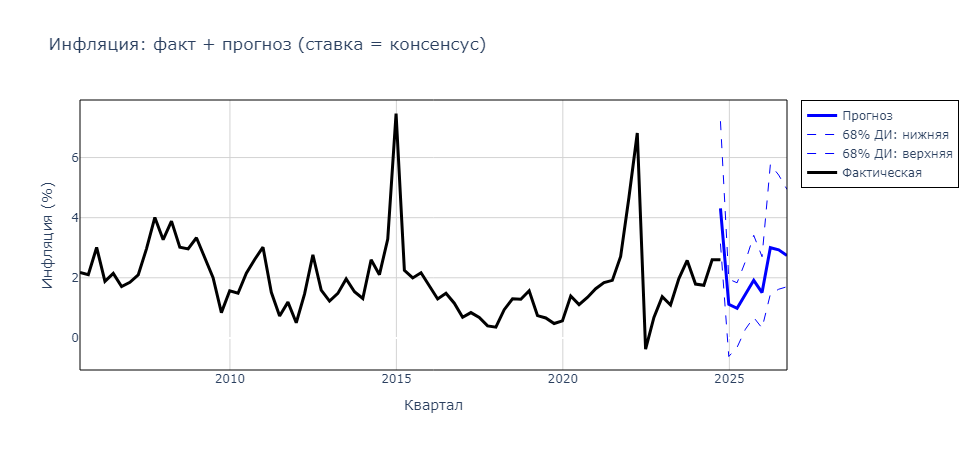
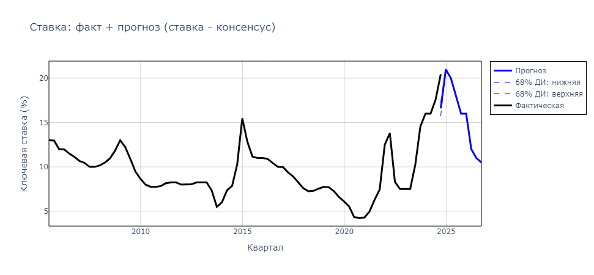
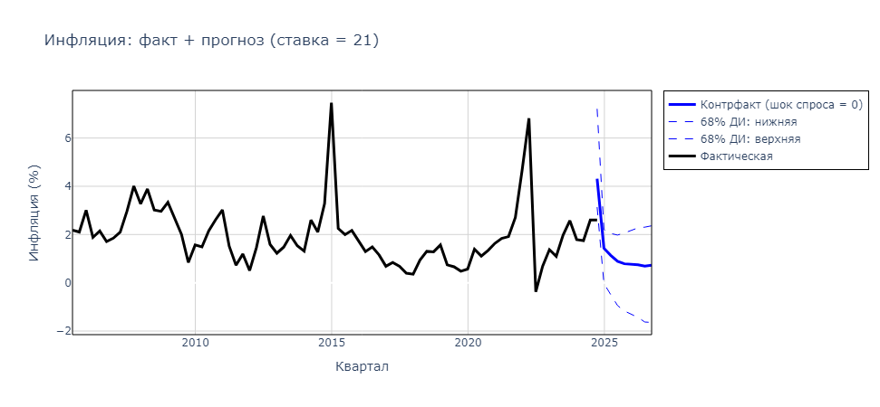

# __!!! ИТС ДЖАСТ ФО ФАН РЕАЛИЗАЦИЯ РАБОТЫ [@youarenadin](https://github.com/youarenadin) !!!__


<!--Установка-->
## Установка
У вас должны быть установлены [зависимости проекта](https://github.com/das1204/Anti-inflation-Policy-in-Russia-dot-py#зависимости).

1. Клонирование репозитория 

```git clone https://github.com/das1204/Anti-inflation-Policy-in-Russia-dot-py.git```

2. Переход в директорию Anti-inflation-Policy-in-Russia-dot-py

```cd Anti-inflation-Policy-in-Russia-dot-py```

3. Установка зависимостей

```pip3 install -r requirements.txt```

4. Запуск скрипта для демонстрации работы

```python3 app.py```

<!--зависимости-->
## Зависимости
Эта программа зависит от интепретатора Python версии 3.9 или выше.

Про MATLAB спршивайте [@youarenadin](https://github.com/youarenadin).

<!--Логика работы-->
## Алгоритм
Этот код использовался для построения контрфактических симуляций и условного прогноза (```conditional forecast```).


В работе на первом этапе была оценена структурная байесовская векторная авторегрессия (BVAR). Здесь не приведен код для оценки: она проводилась в пакете от Европейского Центрального банка BEAR Toolbox. 


## Идея
По итогам байесовской оценки, после 1000 итераций семплирования по Гиббсу, мы имеем 1000 семплов или 1000 "моделей", каждая из которых соответствует нашему ```prior```, данным, знаковым ограничениям. 


__I. На их основе мы можем построить 1000 контрфактических симуляций, рекурсивно пересчитывая шоки и значения переменных. Из 1000 контрфактических симуляций мы затем строим медианную траекторию (с медианными траекториями логика такая же, как в построении импульсных откликов). Этот код выполняет симуляции по 2 сценариям:__

__1)__ Фиксированная ключевая ставка (i) = 7,5;



__2)__ Нулевые шоки ДКП (интерпретация: ключевая ставка по Тейлору).

<div style="display: flex; justify-content: center; gap: 20px;">
  
  
</div>

__II. УСЛОВНЫЙ ПРОГНОЗ:__

__1)__ Ставка = 21 с 2025Q1, все шоки = 0, кроме MP;



__1.a.1)__ Cтавка = ZCYC, все шоки = 0, кроме MP;

<div style="display: flex; justify-content: center; gap: 20px;">
  
  
</div>

__1.a.2)__ Cтавка = консенсус, все шоки = 0, кроме MP;

<div style="display: flex; justify-content: center; gap: 20px;">
  
  
</div>

__2)__ Ставка = 21 с 2025Q1, все шоки = 0, кроме спроса;



__2.а)__ Ставка = консенсус либо ZCYC, шоки спроса;

<div style="display: flex; justify-content: center; gap: 20px;">
  
  
</div>

__3-4)__ Ставка = 21 с 2025Q3, дефицит = Минфин / опрос БР, шок AS = 0, шоки PrivateAD зафиксированы на уровне среднеквартальных 2024 года;


__3а-4а)__ Ставка = консенсус или ZCYC, дефицит = Минфин / опрос БР, шок AS = 0, шок MP пересчитывается, шок FP пересчитывается, шоки PrivateAD равны среднеквартальным за 2024 (для каждого семпла);


__Доп)__ Пытаемся прийти в таргет. Ставка = консенсус или ZCYC, дефицит = Минфин / опрос БР, шок AS = 0, шок MP пересчитывается, шок FP пересчитывается, спроса - нет.

__III. НЕЙТРАЛЬНАЯ СТАВКА:__

__1)__ Сценарий 2 (нет условия на бюджет, есть только шоки спроса);

__2)__ Сценарий 3 (есть условие на бюджет: либо минфин, либо опрос);

__3)__ Сценарий 3 (есть условие на бюджет: либо минфин, либо опрос, спроса - нет);

__Доп)__ Нулевые шоки спрроса, условие на ставку, условие на бюджет.

__IV. ПРОВЕРКА УСЛОВНОГО ПРОГНОЗА:__

__1)__ Базовый VAR-прогноз;

__2)__ Проверка 2 условий: должны получиться нулевые шоки, как будто с помощью условий был выполнен базовый прогноз;

__3)__ Проверка 2 условий: подставляем траекторию бюджета из сценария 1 (КС = 21 и все) и смотрим, получится ли такая же инфляция.
