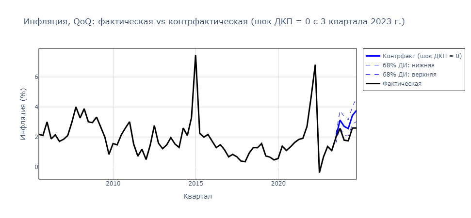

# Anti-inflation Policy in Russia


<!--Установка-->
## Установка
У вас должны быть установлены [зависимости проекта](https://github.com/das1204/Anti-inflation-Policy-in-Russia-dot-py#зависимости).

1. Клонирование репозитория 

```git clone https://github.com/das1204/Anti-inflation-Policy-in-Russia-dot-py.git```

2. Переход в директорию Anti-inflation-Policy-in-Russia-dot-py

```cd Anti-inflation-Policy-in-Russia-dot-py```

3. Установка зависимостей

```pip3 install -r requirements.txt```

4. Запуск скрипта для демонстрации работы

```python3 app.py```

<!--зависимости-->
## Зависимости
Эта программа зависит от интепретатора Python версии 3.9 или выше.

Про MATLAB спршивайте [@youarenadin](https://github.com/youarenadin).

<!--Логика работы-->
## Алгоритм
Этот код использовался для построения контрфактических симуляций и условного прогноза (```conditional forecast```).


В работе на первом этапе была оценена структурная байесовская векторная авторегрессия (BVAR). Здесь не приведен код для оценки: она проводилась в пакете от Европейского Центрального банка BEAR Toolbox. 


## Идея
По итогам байесовской оценки, после 1000 итераций семплирования по Гиббсу, мы имеем 1000 семплов или 1000 "моделей", каждая из которых соответствует нашему ```prior```, данным, знаковым ограничениям. 


__I. На их основе мы можем построить 1000 контрфактических симуляций, рекурсивно пересчитывая шоки и значения переменных. Из 1000 контрфактических симуляций мы затем строим медианную траекторию (с медианными траекториями логика такая же, как в построении импульсных откликов). Этот код выполняет симуляции по 2 сценариям:__

1) если бы ключевая ставка была зафиксирована на уровне 7,5% с 2023к3;


2) если бы шоки ДКП были равны 0 с 2023к3 (интерпретация: ключевая ставка по Тейлору).




__II. Далее строится условный прогноз по 3 сценариям:__

1) все шоки, кроме шоков ДКП = 0;


2) все шоки, кроме шоков ДКП и шоков частного спроса = 0. Шоки частного спроса предполагаются равными среднему за 2024 г. (для каждого семпла);


3) все шоки, кроме шоков ДКП и шоков частного спроса = 0. Накладывается дополнительное условие на баланс бюджета: он равен траектории, согласно (1) проекту федерального бюджета Министерства финансов и (2) макроэкономическому опросу Банка России.


Все 3 сценария рассчитаны в 3 вариантах: ключевая ставка равна 21% на всем прогнозном горизонте, ключевая ставка равна консенсус-прогнозу и ключевая ставка равна ожиданиям по кривой бескупонной доходности Московской биржи.

__III. В конце рассчитана нейтральная ставка: такая, которая будет приводить инфляцию к 1% ежеквартально и к 4% ежегодно.__
